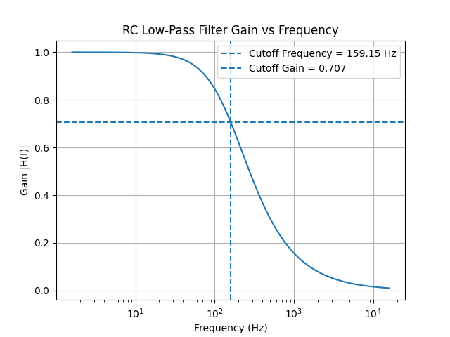
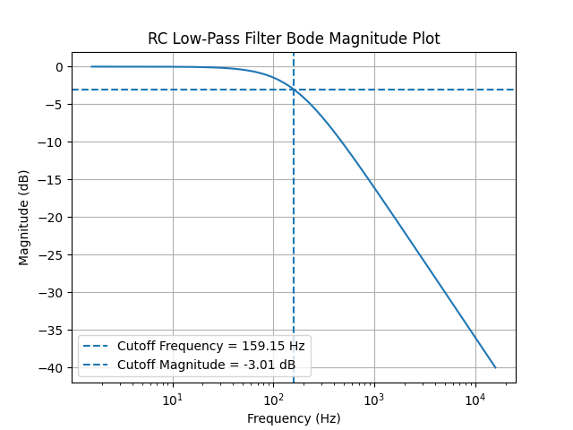
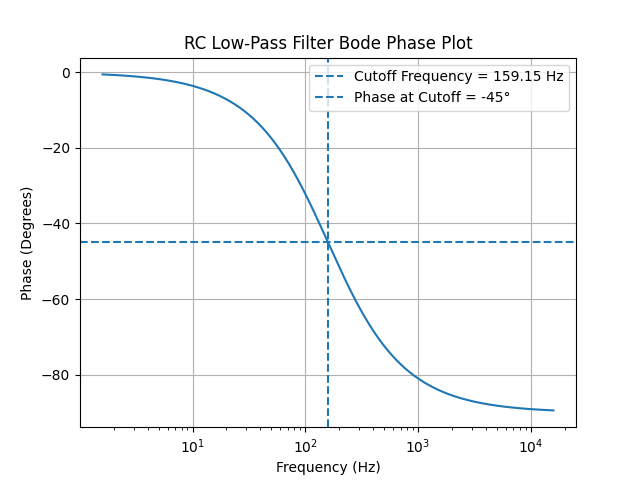

# RC Low-Pass Filter Analyzer

A Python-based analyzer for the frequency response of a first-order RC low-pass filter.

## Circuit Schematic

[Download/View the original DWF schematic](schematic/rc_low_pass_filter.dwf)

## Features

- Accepts user-defined resistance, capacitance, frequency, and input voltage
- Validates numerical user input
- Calculates:
  - RC time constant
  - Cutoff frequency
  - Capacitive reactance
  - Voltage gain
  - Output voltage
  - Phase shift
- Automatically generates a frequency sweep around the cutoff frequency
- Produces:
  - Gain vs. frequency plot
  - Bode magnitude plot
  - Bode phase plot

## Theory

The cutoff frequency of an RC low-pass filter is:

fc = 1 / (2πRC)

The magnitude response is:

|H(f)| = 1 / sqrt(1 + (2πfRC)^2)

The phase response is:

φ(f) = -tan⁻¹(2πfRC)

At the cutoff frequency:

- Gain ≈ 0.707
- Magnitude ≈ -3 dB
- Phase = -45°

## Technologies

- Python
- NumPy
- Matplotlib
- AutoCAD

## Example

For:

- R = 1 kΩ
- C = 1 µF

The calculated cutoff frequency is approximately:

159.15 Hz

## Gain Response

## Bode Magnitude Plot

## Bode Phase Plot

